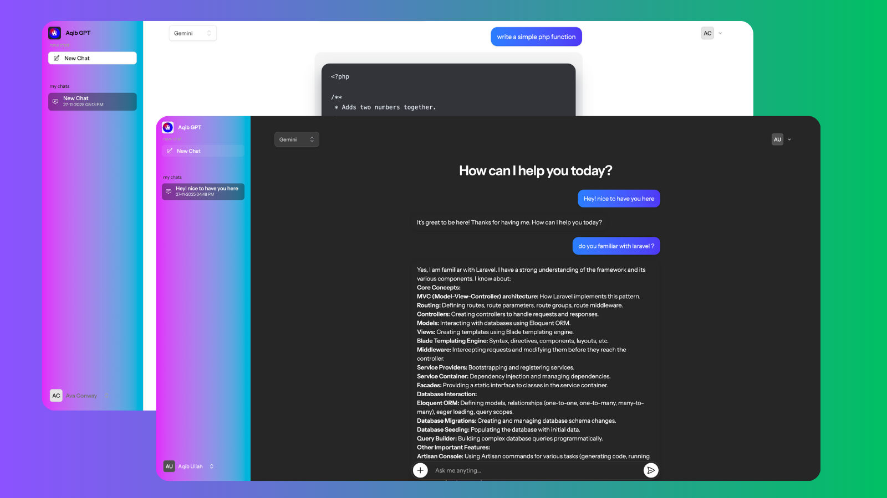

<p align="center">
  
</p>

# aqibGPT

A powerful, flexible AI chat platform built with Laravel that allows seamless switching between multiple AI providers. Experience the freedom to choose between OpenAI, Google Gemini, and Ollama(DeepSeek) without being locked into a single provider.

## ✨ Features

- **Multi-Provider Support**: Easily switch between OpenAI, Google Gemini, and Ollama
- **Strategy Pattern Architecture**: Clean, extensible design for adding new AI providers
- **Real-time Chat Interface**: Built with Livewire Volt for reactive, real-time conversations
- **Streaming Responses**: Support for streaming AI responses for better user experience
- **Chat Sessions**: Persistent chat sessions with message history
- **Modern UI**: Beautiful, responsive interface built with TailwindCSS v4
- **User Authentication**: Secure authentication powered by Laravel Fortify
- **Two-Factor Authentication**: Enhanced security with 2FA support
- **Session Management**: Create, manage, and switch between multiple chat sessions
- **Context-Aware Conversations**: Maintain conversation context across messages

## 🚀 Tech Stack

- **Backend Framework**: Laravel v12.x
- **Frontend Framework**: Livewire (Volt) v3.x
- **Styling**: TailwindCSS v4.x
- **Authentication**: Laravel Fortify
- **Database**: SQLite (configurable to MySQL/PostgreSQL)

## 🤖 Supported AI Providers

### OpenAI
- Models: GPT-4o-mini (default), and other OpenAI models
- Features: Streaming support, context management
- Package: `openai-php/laravel`

### Google Gemini
- Models: Gemini 2.0 Flash (default), and other Gemini models
- Features: Fast responses, multimodal support
- Package: `google-gemini-php/laravel`

### Ollama
- Models: Llama 3.1 (default), and any Ollama-compatible models
- Features: Self-hosted, privacy-focused, local inference
- Package: `cloudstudio/ollama-laravel`

## 📋 Prerequisites

- PHP >= 8.2
- Composer
- Node.js >= 18.x and npm
- SQLite (or MySQL/PostgreSQL)
- For Ollama: Ollama server running locally or remotely

## 🔧 Installation

1. **Clone the repository**
   ```bash
   git clone https://github.com/AqibUllah/aqibGPT
   cd aqibGPT
   ```

2. **Install PHP dependencies**
   ```bash
   composer install
   ```

3. **Install Node dependencies**
   ```bash
   npm install
   ```

4. **Environment setup**
   ```bash
   cp .env.example .env
   php artisan key:generate
   ```

5. **Configure environment variables**
   Edit `.env` file and add your API keys:
   ```env
   # Default AI Provider (gemini, openai, ollama)
   AI_DEFAULT_MODEL=gemini

   # OpenAI Configuration
   OPENAI_API_KEY=your_openai_api_key
   OPENAI_MODEL=gpt-4o-mini
   OPENAI_ENDPOINT=https://api.openai.com/v1/chat/completions

   # Gemini Configuration
   GEMINI_API_KEY=your_gemini_api_key
   GEMINI_MODEL=gemini-2.0-flash
   GEMINI_ENDPOINT=

   # Ollama Configuration
   OLLAMA_MODEL=llama3.1
   OLLAMA_URL=http://127.0.0.1:11434
   OLLAMA_DEFAULT_PROMPT=Hello, how can I assist you today?
   OLLAMA_CONNECTION_TIMEOUT=300
   ```

6. **Run migrations**
   ```bash
   php artisan migrate
   ```

7. **Build assets**
   ```bash
   npm run build
   ```

8. **Start the development server**
   ```bash
   php artisan serve
   ```

   Or use the convenient dev script:
   ```bash
   composer run dev
   ```

## ⚙️ Configuration

### AI Provider Configuration

The AI providers are configured in `config/ai.php`. You can customize:

- Default provider
- Model names for each provider
- API endpoints
- Connection timeouts
- Default prompts

### Switching AI Providers

You can switch AI providers in two ways:

1. **Via Session**: The selected provider is stored in the user session
2. **Via Environment**: Set `AI_DEFAULT_MODEL` in `.env` file

### API Keys

Make sure to add your API keys to the `.env` file:

- **OpenAI**: Get your API key from [OpenAI Platform](https://platform.openai.com/)
- **Gemini**: Get your API key from [Google AI Studio](https://makersuite.google.com/app/apikey)
- **Ollama**: No API key needed, but ensure Ollama server is running

## 🏗️ Architecture

aqibGPT uses the **Strategy Pattern** to implement a flexible, extensible AI provider system:

```
app/Services/AI/
├── Contracts/
│   └── ChatModelStrategy.php      # Interface for AI providers
├── Strategies/
│   ├── OpenAIStrategy.php          # OpenAI implementation
│   ├── GeminiStrategy.php          # Gemini implementation
│   └── OllamaStrategy.php          # Ollama implementation
├── ChatModelFactory.php            # Factory for creating strategies
└── ChatService.php                 # Service layer for chat operations
```

### How It Works

1. **ChatModelStrategy Interface**: Defines the contract all AI providers must implement
2. **Strategy Classes**: Each provider (OpenAI, Gemini, Ollama) implements the interface
3. **ChatModelFactory**: Creates the appropriate strategy based on the selected provider
4. **ChatService**: Provides a unified interface for interacting with any AI provider

### Adding a New AI Provider

To add a new AI provider:

1. Create a new strategy class implementing `ChatModelStrategy`
2. Add the provider configuration to `config/ai.php`
3. Register it in `ChatModelFactory::make()`

Example:
```php
// app/Services/AI/Strategies/NewProviderStrategy.php
class NewProviderStrategy implements ChatModelStrategy
{
    public function respond(string $prompt, array $context = [], array $options = [], array $attachments = []): array
    {
        // Implementation
    }
}
```

## 📁 Project Structure

```
aqibGPT/
├── app/
│   ├── Http/Controllers/          # HTTP Controllers
│   │   ├── AIModelController.php  # AI provider switching
│   │   └── ChatController.php     # Chat operations
│   ├── Models/                    # Eloquent Models
│   │   ├── ChatSession.php        # Chat session model
│   │   └── ChatMessage.php        # Chat message model
│   ├── Services/AI/               # AI service layer
│   └── Livewire/                  # Livewire components
├── config/
│   └── ai.php                     # AI provider configuration
├── database/
│   └── migrations/                # Database migrations
├── resources/
│   ├── views/
│   │   ├── livewire/              # Livewire views
│   │   └── components/            # Blade components
│   ├── css/
│   └── js/
└── routes/
    └── web.php                    # Application routes
```

## Usage

### Starting a Chat Session

1. Log in to your account
2. Navigate to the dashboard
3. Select your preferred AI provider from the settings
4. Start chatting!

### Switching AI Providers

1. Click on the AI provider selector in the header
2. Choose from OpenAI, Gemini, or Ollama
3. The selection is saved in your session

### Chat Features

- **New Session**: Create a new chat session
- **Session History**: View and switch between previous sessions
- **Streaming**: Real-time streaming responses (when supported by provider)
- **Context**: Conversations maintain context across messages

## 🧪 Testing

Run the test suite:

```bash
composer test
```

Or with Pest:

```bash
php artisan test
```

## 🛠️ Development

### Development Workflow

The project includes a convenient development script that runs multiple services:

```bash
composer run dev
```

This starts:
- Laravel development server
- Queue worker
- Log viewer (Pail)
- Vite dev server

### Code Style

The project uses Laravel Pint for code formatting:

```bash
./vendor/bin/pint
```

## License

This project is open-sourced software licensed under the [MIT license](LICENSE.md).

## Contributing

Contributions are welcome! Please feel free to submit a Pull Request.

## Support

For issues, questions, or contributions, please open an issue on the repository.

---

**Built with ❤️ using Laravel, Livewire, and TailwindCSS**

